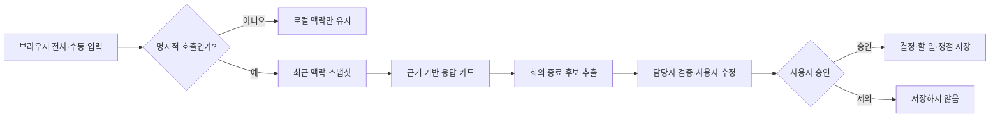

# 모이다 — Meeting Copilot

회의록이 길어져도 실행 누락이 줄지 않는 이유는 기록량이 아니라, 대화가 **결정·담당자·미결 쟁점으로 합의되는 순간**이 관리되지 않기 때문이라고 보았습니다.

기존 회의 AI는 모든 대화를 녹음하고 회의가 끝난 뒤 요약을 제공합니다. 하지만 오프라인 프로젝트팀에서는 회의 중 방향이 바뀌고, 같은 문장도 누가 책임질지 합의되지 않으면 실행으로 이어지지 않습니다. 모이다는 AI가 계속 개입하는 대신 사용자가 명시적으로 부른 순간만 최근 맥락을 분석하고, 종료 시 사람이 확인한 산출물만 저장하는 공용 화면 워크스페이스입니다.

> 현재 단계는 제품 가설과 안전한 실행 경계를 검증하기 위한 MVP입니다. 실제 고객·보안 검증과 운영 데이터는 아직 확보하지 않았습니다.

## 문제를 이렇게 좁혔습니다

처음부터 “회의 전체를 잘 요약하는 AI”를 목표로 두지 않았습니다.

| 관찰한 문제 | 제품에서 내린 결정 |
| --- | --- |
| 일상 발화까지 모델로 보내면 비용과 지연이 누적됨 | 브라우저의 로컬 호출 게이트가 명시적 호출만 통과시킴 |
| 요약은 있어도 결정 근거와 담당자가 불명확함 | 응답에 근거 구간과 담당자 후보를 구조화 |
| AI가 만든 할 일이 그대로 저장되면 책임이 모호함 | 후보를 수정·제외하고 사람이 승인해야만 영속화 |
| 회의 원문 저장은 도입 장벽이 됨 | 전사·오디오 컬럼 자체를 DB 스키마에서 제외 |
| 모든 요청에 고성능 모델을 쓰면 경제성이 낮음 | 단순 요청은 맥락 모델에서 끝내고 필요한 경우만 추론 모델로 승격 |

핵심 가설은 다음과 같습니다.

> 회의 전체를 더 많이 기록하는 것보다, 합의가 필요한 순간에 AI를 호출하고 승인된 결과만 남기는 편이 실행 누락을 더 잘 줄일 수 있다.

## 사용자 흐름



## 구현 범위

- 브라우저 Web Speech 기반 실시간 전사, 자동 재시작과 수동 입력 폴백
- 로컬 정규식 호출 게이트: 일반 발화는 모델 API를 호출하지 않음
- 맥락 모델에서 고성능 추론 모델로 선택적으로 승격하는 에이전트 하네스
- Structured Outputs, Zod 런타임 스키마와 근거 범위 검증
- 회의 맥락 스냅샷, 회의 중 응답, 종료 산출물 후보와 승인 API
- 팀원 명단 서버 검증과 명단 밖 담당자의 미배정 처리
- HttpOnly 서명 세션, 팀 소속과 소유자 권한의 서버 재검사
- Stripe Checkout·Subscription 웹훅 골격과 멱등 상태 동기화
- 전사·오디오 컬럼이 없는 PostgreSQL 스키마
- 고정 평가 세트와 제품 출시 기준

## AI가 개입할 수 있는 경계

`MeetingAgentHarness`는 프롬프트 모음이 아니라 실행 정책입니다.

1. 브라우저가 명시적 호출만 통과시킵니다.
2. 맥락 모델이 의도, 지시대명사와 근거 구간을 선택합니다.
3. 상충 검토·계산·중요 의사결정만 추론 모델로 승격합니다.
4. 모든 결과는 JSON Schema와 Zod 검증을 통과해야 합니다.
5. 원문에 없는 근거, 낮은 신뢰도와 명단 밖 담당자는 서버가 제거합니다.
6. 모델 실패는 빈 후보와 재시도 가능 상태로 축소되어 회의를 멈추지 않습니다.
7. 종료 산출물은 사용자가 승인하기 전에는 DB에 저장되지 않습니다.

자세한 실행 구조는 [에이전트 하네스와 아키텍처](docs/ARCHITECTURE.md)에 기록했습니다.

## 데이터와 개인정보 경계

전사 원문은 브라우저 메모리와 요청 처리 중 서버 메모리에만 존재합니다. 애플리케이션 DB와 로그에는 저장하지 않습니다. DB에는 사용자가 최종 승인한 결정, 할 일과 미결 쟁점만 들어갈 수 있습니다.

Web Speech와 LLM 공급자에게 전달되는 데이터에는 각 공급자의 정책이 적용됩니다. 따라서 현재 구조를 실제 조직에 도입하려면 공급자 보존 정책, 동의 절차, 지역별 개인정보 규정과 BYOK·온프레미스 요구를 별도로 검토해야 합니다.

## 검증 기준

```bash
npm test
npm run typecheck
npm run build
npm run eval
```

고정 평가 세트에서 다음 조건을 릴리스 게이트로 둡니다.

| 평가 항목 | 기준 | 이유 |
| --- | ---: | --- |
| 근거성 | 100% | 원문 밖 내용을 결정 근거로 제시하지 않기 위해 |
| 명단 외 담당자 | 0건 | 존재하지 않는 담당자 배정을 막기 위해 |
| 일반 발화의 모델 호출 | 0건 | 불필요한 전송·비용·개입을 막기 위해 |

운영 단계에서는 내용이 아니라 호출 지연, 토큰, 추정 비용, 카드 제거율과 후보 수정·제외율을 수집하도록 설계했습니다.

## 기술 스택

| 영역 | 기술 | 선택 이유 |
| --- | --- | --- |
| Application | Nuxt 4, Vue 3, TypeScript | 화면과 서버 API를 하나의 타입 흐름에서 관리 |
| AI orchestration | OpenAI SDK, Structured Outputs, Zod | 출력 계약과 런타임 검증을 함께 적용 |
| Data | PostgreSQL, `postgres` | 승인 산출물과 팀·구독 메타데이터의 관계형 관리 |
| Auth | HttpOnly signed session | 브라우저 스크립트에서 세션 토큰 분리 |
| Billing | Stripe | Checkout과 웹훅 기반 구독 상태 동기화 |
| Test | Vitest, Nuxt typecheck | 호출 정책·근거성·권한 경계를 회귀 테스트 |

## 주요 API

| Method | Path | 역할 | 저장 여부 |
| --- | --- | --- | --- |
| `POST` | `/api/analyze` | 명시적 호출에 대한 근거 기반 카드 생성 | 저장하지 않음 |
| `POST` | `/api/context-snapshot` | 세션 맥락 압축 | 저장하지 않음 |
| `POST` | `/api/meetings/:id/wrapup-preview` | 종료 산출물 후보 생성 | 저장하지 않음 |
| `POST` | `/api/meetings/:id/wrapup-confirm` | 사용자가 승인한 산출물 저장 | 승인 항목만 저장 |
| `POST` | `/api/billing/checkout` | 좌석 구독 Checkout 생성 | Stripe 메타데이터 |
| `POST` | `/api/webhooks/stripe` | 구독 상태 멱등 동기화 | 구독 메타데이터 |

인증과 워크스페이스 API로 `/api/auth/signup`, `/api/auth/login`, `/api/auth/logout`, `/api/auth/check-email`, `/api/teams`, `/api/meetings`도 포함합니다.

## 실행

요구 환경은 Node.js 22 이상입니다.

```bash
npm install
cp .env.example .env
npm run dev
```

기본값인 `NUXT_LLM_MODE=mock`에서는 API 키 없이 전체 승인 흐름을 확인할 수 있습니다. 실제 모델을 연결할 때만 `.env`에 모델 공급자 설정을 추가합니다. 실제 키는 저장소에 커밋하지 않습니다.

## 담당 범위와 협업 관점

- 회의 요약이 아니라 실행 합의라는 제품 문제 정의
- 호출 조건, 모델 승격, 저장 범위와 사람 승인 정책 설계
- Nuxt 화면·서버 API·데이터 계약·평가 코드 구현
- 개발과 제품 판단이 분리되지 않도록 요구사항을 테스트 가능한 출시 기준으로 변환
- 가격과 초기 고객 가설을 기능 우선순위에 연결

[제품·가격 가설](docs/PRODUCT_STRATEGY.md)은 구현된 사실과 앞으로 검증할 가설을 구분해 기록합니다.

## 아직 검증하지 못한 것

- 실제 팀의 실행 누락과 후속 완료율 개선
- 여러 명이 동시에 사용하는 오프라인 회의 환경의 음성 인식 품질
- 조직별 보안·보존 정책을 만족하는 배포 구성
- 좌석 기반 가격과 초기 시장의 유료 전환 가능성

다음 단계는 기능 추가보다 소규모 팀 파일럿에서 `승인된 할 일 비율`, `미배정 해소 시간`, `후속 완료율`을 측정하는 것입니다.
