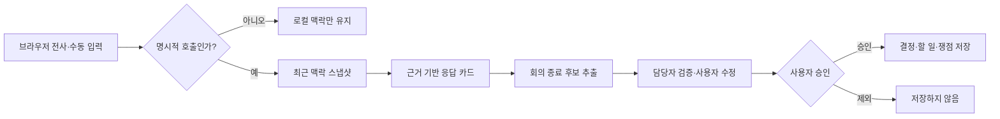

# 모이다 — Meeting Copilot

현재 개발 빌드는 **v0.3.0-alpha.1 · 1차 통합 테스트 반영본**입니다. `v0.2.0` 첫 통합 테스트에서 확인한 문제를 반영한 프리릴리스이며, 정식 운영 버전은 아닙니다.

## 현재 실행 경로: Vue + Spring 서비스

### 회의 맥락 확장 — 현재 구현과 다음 순서

- **제품 방향:** 대화는 이어가세요. 필요한 확인은 AI에게 맡기세요. 정해진 분류보다 대화 흐름을 따르고, 필요한 맥락만 찾고, 회의를 막지 않고, 사람이 확정하며, 허용된 자료만 참고합니다.
- **회의 중 확인:** `/api/meetings/{meeting}/ask`는 승인한 현재 전사를 스냅샷으로 받아 설정된 로컬 모델 또는 DeepSeek에 비동기로 질의합니다. 최근 발화와 질문 단어 관련성을 기준으로 최대 9,000자/80개 문장을 선택합니다. 의미 기반 벡터 RAG·누적 요약 메모리는 아직 아닙니다. 질문·답변은 호출자 전용 임시 작업이며 15분 후 만료되고 DB에 저장하지 않습니다. 모델 출력은 원문 ID를 검증하지만 의미적 정확성을 보장하지 않습니다.
- **기다리는 동안:** 전사와 화면 전환은 계속 가능하며, 요청 취소·상태 재확인·이후 대화 변경 안내를 제공합니다. 검토할 내용으로 옮겨도 사람이 확인하기 전에는 저장하지 않습니다.
- **전사:** 선택한 마이크 입력을 최대 약 4초 단위 WAV로 처리합니다. Groq Whisper(기본), Azure Speech F0 또는 로컬 전사 서버를 선택하며 단어 단위 스트리밍은 아닙니다. Groq는 별도 음성 전송 동의와 서버 API 키가 필요합니다. 무료 플랜·한도는 Groq 콘솔에서 확인하세요. Azure는 별도 설정 시에만 사용합니다. [클라우드 설정](docs/cloud-setup.md) · [로컬 전사 설정](docs/speech-setup.md).
- **자료 권한:** PRIVATE가 기본입니다. 개인 읽기 승인과 TEAM_SHARED 회의 공유를 구분하고, 소유자만 공유 범위 및 권한 요청을 승인합니다. `.txt`/`.md` 드롭은 미리보기만 만들며 저장 동의 후 업로드합니다. 부서는 분류 라벨이고 별도 부서 구성원 RBAC는 미구현입니다.
- **모델 진단:** `/api/llm/status`는 선택된 공급자와 설정 상태를 표시합니다. DeepSeek 키 설정은 실제 연결·잔액·생성 성공을 의미하지 않습니다. 회의 질의·자료함·요약은 요청별 동의 후 선택한 공급자만 사용하며 실패 시 다른 업체로 자동 전환하지 않습니다.
- **실제 검증 범위:** 합성 질문으로 로컬 `qwen3:8b`의 근거 JSON 응답과 도구 호출 형식을 확인했습니다. 실제 회의 음성·외부 STT·장시간 동시 사용은 검증 전입니다. 회의 중 질의는 한 번의 모델 생성이며, 도구 호출 루프는 자료함 에이전트에 적용됩니다.
- **다음 구현 순서:** Groq와 DeepSeek API 키를 서버에 설정 → 선택 마이크의 스트리밍 전사·재연결 검증 → 한국어 회의 샘플 평가 → 회의 중 도구 호출 루프·안건별 맥락 메모리 → 부서 구성원 모델과 운영 보안. 비용 상한·보관 정책·권한 회수 회귀 테스트를 각 단계에 포함합니다.

`npm run dev`는 이제 홍보·데모 랜딩이 아닌 로그인 → 팀 → 회의 작업 공간을 엽니다. 기존 Nuxt 데모는 `npm run dev:legacy`로만 별도 실행합니다. 아래 기존 MVP 설명은 Nuxt 버전 기준입니다.

실행·로그인·DB·전사·AI·회의 화면 문제는 [통합 트러블슈팅](docs/TROUBLESHOOTING.md)에서 우선 확인합니다.

- 설치: Java 21+, Maven, Node 22.9+를 준비하고 `npm --prefix apps/web install` 실행.
- 실행: `.env.service`에 Groq 및 DeepSeek 키를 설정한 뒤 `npm run dev`. 클라우드 구성에서는 Ollama가 필요하지 않습니다. 로컬 모델을 쓰려면 `LLM_PROVIDER=local`을 선택합니다.
- 접속: `http://127.0.0.1:3100`에서 계정 생성 → 팀 생성 → 회의 생성 → 참석자 동의 → 마이크 확인 → 전사 시작.
- 음성: 선택 장치용 Groq/Azure/로컬 전사와 기본 장치용 브라우저 인식 대안을 제공합니다. 화자 자동 식별은 제공하지 않습니다.
- 저장: 원문 검토·동의 후 버전별 서버 저장. AI 확인을 맡길 때에는 별도 동의한 전사 스냅샷이 서버 메모리와 승인한 모델로 전달되지만 DB에는 저장하지 않습니다. 로컬 DB는 `apps/server/data`이며 Git에서 제외됩니다. 중요한 회의는 TXT로도 내보내세요.
- 요약: 저장된 전사 버전으로 요약·결정·할 일·미결 초안을 생성하고 원문 근거를 표시합니다. 자동 확정·저장하지 않습니다. 현재 12,000자 한도이며 긴 회의 분할 요약은 미구현입니다.
- 모델: `LlmGateway` 뒤에서 `LLM_PROVIDER=deepseek|local`로 선택합니다. DeepSeek는 고정 공식 HTTPS 주소로만 연결하며, 요청별 외부 전송 승인이 없으면 차단합니다.
- 외부 설정: Git에서 제외된 `.env.service`에 키를 입력합니다. Groq 무료 플랜 여부는 콘솔에서 확인하며 DeepSeek는 별도 사용량 과금입니다. 기존 fallback 설정으로 새 요청을 자동 외부 전송하지 않습니다.
- 검증: `npm run build:service`. 실제 발화 정확도·장시간 회의·외부 API 실호출은 별도 현장 검증이 필요합니다.

기능별 패키지는 `auth`, `team`, `meeting`, `transcription`, `outcome`, `knowledge`, `llm`으로 나뉩니다. 팀 작업 공간에서 자료함 생성·텍스트 자료 등록·사용자별 읽기 권한·에이전트 배정을 관리합니다. 에이전트는 `search_documents`와 `read_document`만 호출하며, 서버에서 사용자 권한과 배정 자료함의 교집합을 매번 확인합니다. 검색은 키워드 방식이며 벡터 RAG나 에이전트 간 자율 토론은 아닙니다. 모델 호출 최대 4회, 도구 호출 최대 6회로 제한합니다. 기존 Nuxt 자료함과 새 서비스 DB는 자동으로 연결되지 않습니다. 인터넷 공개 전에는 인증 시도 제한, 계정 복구, 운영 TLS·백업·보존/삭제 정책 및 PostgreSQL 검증이 추가로 필요합니다.

회의 노트 UX는 [Notion 공식 회의 노트 안내](https://www.notion.com/help/ai-meeting-notes)의 원문 인용·검토 흐름을 참고했습니다. 전사 엔진의 정확도가 동일하다는 의미는 아닙니다.

회의가 끝나면 요약은 남는데, 정작 “그래서 누가 무엇을 하지?”가 빠지는 경우가 많았습니다. AI가 회의를 모두 듣고 알아서 저장하게 하기보다, 필요할 때만 부르고 사람이 확인한 내용만 남기는 쪽을 택했습니다. **편리함보다 책임이 흐려지지 않는 흐름**을 먼저 만든 회의 AI MVP입니다.

`Nuxt 4` · `TypeScript` · `OpenAI Structured Outputs` · `Zod` · `PostgreSQL` · `Vitest`

## 2026-10-07 개발 확장

`/knowledge`에 **부서 자료함 → 에이전트 배정 → 공통 질문 → 부서별 원문 근거 확인** 흐름을 추가했습니다. 텍스트·표 내용을 자료로 등록하고, 각 에이전트가 배정된 자료함에서만 검색합니다. 현재 검색은 키워드 기반 청크 검색이며 벡터 RAG나 에이전트 간 자율 토론은 아닙니다.

- DB 없는 mock 모드: 합성 예시 데이터와 브라우저 메모리로 체험. 새로고침하면 초기화됩니다.
- DB 연결: 로그인한 팀원이 조회·질의하고, 팀 소유자만 승인 자료 및 에이전트 배정을 변경합니다.
- 실제 모델 연결: 검색 결과만 모델에 전달하고, 반환된 인용이 해당 자료·버전의 원문에 존재하는지 검사합니다. 답변의 의미적 정확성까지 보증하지는 않습니다.
- 모델 미연결: 생성형 답변을 가장하지 않고 검색된 원문만 제공합니다.

[현재 구현 감사와 다음 개발 단계](docs/DEVELOPMENT_AUDIT_2026-10-07.md) · [자료함 실행·API·보안 경계](docs/DEPARTMENT_KNOWLEDGE.md)

기존 회의 화면은 고정 팀·참석자·회의 ID를 사용하는 데모입니다. 전체 요구사항이나 사내 운영 준비가 완료된 상태는 아닙니다.

| 걱정했던 문제 | 제품에서 한 선택 | 확인 결과 | 아직 말할 수 없는 것 |
| --- | --- | --- | --- |
| 일반 발화까지 전송·호출 | 명시적 호출만 통과시키는 로컬 invocation gate | 일반 발화 모델 호출 **0건** | 상시 녹음형 제품이 아님 |
| 원문 밖 근거·존재하지 않는 담당자 | Structured Outputs 뒤 인용문 존재·명단 검증 | 고정 fixture의 차단 조건을 단위 테스트 | 인용문이 존재해도 답변 전체의 정확성을 보증하지 않음 |
| AI 산출물의 자동 저장 | preview와 confirm을 분리하고 승인 항목만 영속화 | 실행 결과는 `npm test`로 재현 | 실제 고객 성과와 운영 보안 검증은 아직 미실시 |

> 문제 정의부터 화면 흐름, 데이터 계약, Agent 실행 정책, 서버 API와 평가 코드까지 직접 연결했습니다. “기능이 된다”가 아니라 “어떤 결과까지 저장해도 되는가”를 출시 기준으로 삼았습니다.

회의록이 길어져도 실행 누락이 줄지 않는 이유는 기록량이 아니라, 대화가 **결정·담당자·미결 쟁점으로 합의되는 순간**이 관리되지 않기 때문이라고 보았습니다.

기존 회의 AI는 모든 대화를 녹음하고 회의가 끝난 뒤 요약을 제공합니다. 하지만 오프라인 프로젝트팀에서는 회의 중 방향이 바뀌고, 같은 문장도 누가 책임질지 합의되지 않으면 실행으로 이어지지 않습니다. 모이다는 AI가 계속 개입하는 대신 사용자가 명시적으로 부른 순간만 최근 맥락을 분석하고, 종료 시 사람이 확인한 산출물만 저장하는 공용 화면 워크스페이스입니다.

> 현재 단계는 제품 가설과 안전한 실행 경계를 검증하기 위한 MVP입니다. 실제 고객·보안 검증과 운영 데이터는 아직 확보하지 않았습니다.

## 문제를 이렇게 좁혔습니다

처음부터 “회의 전체를 잘 요약하는 AI”를 목표로 두지 않았습니다.

| 관찰한 문제 | 제품에서 내린 결정 |
| --- | --- |
| 일상 발화까지 모델로 보내면 비용과 지연이 누적됨 | 브라우저의 로컬 호출 게이트가 명시적 호출만 통과시킴 |
| 요약은 있어도 결정 근거와 담당자가 불명확함 | 응답에 근거 구간과 담당자 후보를 구조화 |
| AI가 만든 할 일이 그대로 저장되면 책임이 모호함 | 후보를 수정·제외하고 사람이 승인해야만 영속화 |
| 회의 원문 저장은 도입 장벽이 됨 | 전사·오디오 컬럼 자체를 DB 스키마에서 제외 |
| 모든 요청에 고성능 모델을 쓰면 경제성이 낮음 | 단순 요청은 맥락 모델에서 끝내고 필요한 경우만 추론 모델로 승격 |

핵심 가설은 다음과 같습니다.

> 회의 전체를 더 많이 기록하는 것보다, 합의가 필요한 순간에 AI를 호출하고 승인된 결과만 남기는 편이 실행 누락을 더 잘 줄일 수 있다.

## 사용자 흐름


```mermaid
flowchart LR
  A[브라우저 전사·수동 입력] --> B{명시적 호출인가?}
  B -- 아니오 --> C[로컬 맥락만 유지]
  B -- 예 --> D[최근 맥락 스냅샷]
  D --> E[근거 기반 응답 카드]
  E --> F[회의 종료 후보 추출]
  F --> G[담당자 검증·사용자 수정]
  G --> H{사용자 승인}
  H -- 승인 --> I[결정·할 일·쟁점 저장]
  H -- 제외 --> J[저장하지 않음]
```

## 구현 범위

- 브라우저 Web Speech 기반 실시간 전사, 자동 재시작과 수동 입력 폴백
- 로컬 정규식 호출 게이트: 일반 발화는 모델 API를 호출하지 않음
- 맥락 모델에서 고성능 추론 모델로 선택적으로 승격하는 에이전트 하네스
- Structured Outputs, Zod 런타임 스키마와 근거 범위 검증
- 회의 맥락 스냅샷, 회의 중 응답, 종료 산출물 후보와 승인 API
- 팀원 명단 서버 검증과 명단 밖 담당자의 미배정 처리
- HttpOnly 서명 세션, 팀 소속과 소유자 권한의 서버 재검사
- Stripe Checkout·Subscription 웹훅 골격과 멱등 상태 동기화
- 전사·오디오 컬럼이 없는 PostgreSQL 스키마
- 고정 평가 세트와 제품 출시 기준

## AI가 개입할 수 있는 경계

`MeetingAgentHarness`는 프롬프트 모음이 아니라 실행 정책입니다.

1. 브라우저가 명시적 호출만 통과시킵니다.
2. 맥락 모델이 의도, 지시대명사와 근거 구간을 선택합니다.
3. 상충 검토·계산·중요 의사결정만 추론 모델로 승격합니다.
4. 모든 결과는 JSON Schema와 Zod 검증을 통과해야 합니다.
5. 원문에 없는 근거, 낮은 신뢰도와 명단 밖 담당자는 서버가 제거합니다.
6. 모델 실패는 빈 후보와 재시도 가능 상태로 축소되어 회의를 멈추지 않습니다.
7. 종료 산출물은 사용자가 승인하기 전에는 DB에 저장되지 않습니다.

자세한 실행 구조는 [에이전트 하네스와 아키텍처](docs/ARCHITECTURE.md)에 기록했습니다.

## 데이터와 개인정보 경계

기존 회의 전사 원문은 브라우저 메모리와 요청 처리 중 서버 메모리에만 존재하며 애플리케이션 DB와 로그에는 저장하지 않습니다. 회의에서는 최종 승인한 결정, 할 일과 미결 쟁점을 저장합니다. 새 부서 자료함은 별도 정책입니다. 소유자가 검토·등록한 자료 원문을 DB에 저장하며, 조회·질의의 공유 범위는 팀 전체입니다. 부서별 비공개 ACL은 아직 없습니다. 자료 등록 화면에 회의 전사를 붙여 넣으면 해당 텍스트도 자료로 저장되므로 공유 정책을 확인해야 합니다.

Web Speech와 LLM 공급자에게 전달되는 데이터에는 각 공급자의 정책이 적용됩니다. 따라서 현재 구조를 실제 조직에 도입하려면 공급자 보존 정책, 동의 절차, 지역별 개인정보 규정과 BYOK·온프레미스 요구를 별도로 검토해야 합니다.

## 검증 기준

```bash
npm test
npm run typecheck
npm run build
npm run eval
```

고정 평가 세트에서 다음 조건을 릴리스 게이트로 둡니다.

| 평가 항목 | 기준 | 이유 |
| --- | ---: | --- |
| 근거성 | 100% | 원문 밖 내용을 결정 근거로 제시하지 않기 위해 |
| 명단 외 담당자 | 0건 | 존재하지 않는 담당자 배정을 막기 위해 |
| 일반 발화의 모델 호출 | 0건 | 불필요한 전송·비용·개입을 막기 위해 |

평가 fixture와 숫자가 의미하는 범위는 [평가 문서](docs/EVALUATION.md)에 분리했습니다. 12/12는 정해둔 실패 사례를 막는다는 뜻이며, 실제 고객 성과나 외부 모델 정확도 100%를 뜻하지 않습니다.

운영 단계에서는 내용이 아니라 호출 지연, 토큰, 추정 비용, 카드 제거율과 후보 수정·제외율을 수집하도록 설계했습니다.

## 기술 스택

| 영역 | 기술 | 선택 이유 |
| --- | --- | --- |
| Application | Nuxt 4, Vue 3, TypeScript | 화면과 서버 API를 하나의 타입 흐름에서 관리 |
| AI orchestration | OpenAI SDK, Structured Outputs, Zod | 출력 계약과 런타임 검증을 함께 적용 |
| Data | PostgreSQL, `postgres` | 승인 산출물과 팀·구독 메타데이터의 관계형 관리 |
| Auth | HttpOnly signed session | 브라우저 스크립트에서 세션 토큰 분리 |
| Billing | Stripe | Checkout과 웹훅 기반 구독 상태 동기화 |
| Test | Vitest, Nuxt typecheck | 호출 정책·근거성·권한 경계를 회귀 테스트 |

## 주요 API

| Method | Path | 역할 | 저장 여부 |
| --- | --- | --- | --- |
| `POST` | `/api/analyze` | 명시적 호출에 대한 근거 기반 카드 생성 | 저장하지 않음 |
| `POST` | `/api/context-snapshot` | 세션 맥락 압축 | 저장하지 않음 |
| `POST` | `/api/meetings/:id/wrapup-preview` | 종료 산출물 후보 생성 | 저장하지 않음 |
| `POST` | `/api/meetings/:id/wrapup-confirm` | 사용자가 승인한 산출물 저장 | 승인 항목만 저장 |
| `POST` | `/api/billing/checkout` | 좌석 구독 Checkout 생성 | Stripe 메타데이터 |
| `POST` | `/api/webhooks/stripe` | 구독 상태 멱등 동기화 | 구독 메타데이터 |

인증과 워크스페이스 API로 `/api/auth/signup`, `/api/auth/login`, `/api/auth/logout`, `/api/auth/check-email`, `/api/teams`, `/api/meetings`도 포함합니다.

## 실행

요구 환경은 Node.js 22 이상입니다.

```bash
npm install
cp .env.example .env
npm run dev
```

기본값인 `NUXT_LLM_MODE=mock`에서는 API 키 없이 전체 승인 흐름을 확인할 수 있습니다. 실제 모델을 연결할 때만 `.env`에 모델 공급자 설정을 추가합니다. 실제 키는 저장소에 커밋하지 않습니다.

## 담당 범위와 협업 관점

- 회의 요약이 아니라 실행 합의라는 제품 문제 정의
- 호출 조건, 모델 승격, 저장 범위와 사람 승인 정책 설계
- Nuxt 화면·서버 API·데이터 계약·평가 코드 구현
- 개발과 제품 판단이 분리되지 않도록 요구사항을 테스트 가능한 출시 기준으로 변환
- 가격과 초기 고객 가설을 기능 우선순위에 연결

[제품·가격 가설](docs/PRODUCT_STRATEGY.md)은 구현된 사실과 앞으로 검증할 가설을 구분해 기록합니다.

## 아직 검증하지 못한 것

- 실제 팀의 실행 누락과 후속 완료율 개선
- 여러 명이 동시에 사용하는 오프라인 회의 환경의 음성 인식 품질
- 조직별 보안·보존 정책을 만족하는 배포 구성
- 좌석 기반 가격과 초기 시장의 유료 전환 가능성

다음 단계는 기능 추가보다 소규모 팀 파일럿에서 `승인된 할 일 비율`, `미배정 해소 시간`, `후속 완료율`을 측정하는 것입니다.

이번 확장은 팀 파일럿 이전의 개발 단계입니다. 원문·초안·수정 이력의 동의 기반 보존, 실제 회의 ID와 인증 UI 연결, 부서별 비공개 권한, 공급자 전송 정책, 운영 의존성 보안 검토가 남아 있습니다. `npm audit`에서 발견된 기존 의존성 경고는 감사 문서에 기록했으며 자동 메이저 변경이나 운영 배포는 수행하지 않았습니다.
