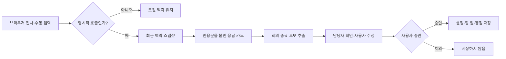

# 모이다 — Meeting Copilot

**회의에서 결정한 일과 담당자를 함께 확인하고 남기는 공유 워크스페이스입니다.** 사용자가 필요할 때 AI를 호출하면 최근 대화에서 후보를 만들고, 회의 종료 시 사람이 수정·승인한 결정·할 일·미결 쟁점만 저장합니다. 회의의 기록량보다 합의와 후속 실행이 이어지는 흐름에 집중한 MVP입니다.

[아키텍처](docs/ARCHITECTURE.md) · [평가 기록](docs/EVALUATION.md) · [제품·가격 가설](docs/PRODUCT_STRATEGY.md)

`Nuxt 4` · `TypeScript` · `OpenAI Structured Outputs` · `Zod` · `PostgreSQL` · `Vitest`

## 문제를 좁히고 구현한 과정

프로젝트 회의에서는 방향이 바뀌거나 같은 문장을 서로 다르게 이해하면서 결정과 담당자가 불명확해질 수 있습니다. 이를 정리하는 데 드는 합의·재작업 비용을 줄이는 것을 제품 가설로 삼았습니다. 먼저 호출 조건과 승인 절차를 명시적으로 만들고, 맥락 해석과 후보 추출이 필요한 부분에 모델을 연결했습니다.

일반 발화는 브라우저에 맥락으로 유지하고, 명시적 호출만 모델 요청으로 보냅니다. 단순 요청은 맥락 모델에서 처리하며, 상충 검토·계산 등 필요한 경우 추론 모델로 승격합니다. 모델 응답은 스키마와 인용문 출처·담당자 명단을 확인한 뒤 화면에 보여줍니다.

## 담당 역할과 구현 결과

문제 정의부터 제품 흐름, 데이터 계약, Nuxt 화면, 서버 API와 평가 코드를 구현했습니다. 호출 조건, 모델 승격, 저장 범위를 코드로 연결하고, 가격·초기 고객 가설은 [제품 전략 문서](docs/PRODUCT_STRATEGY.md)에 따로 정리했습니다.

| 구현한 흐름 | 현재 결과 |
| --- | --- |
| 명시적 호출·출력 검증 | 잘못된 후보를 반환하는 결정론적 provider를 사용한 경계 테스트 **12/12**를 보고했습니다. |
| 호출 정책·데이터 계약·권한 확인 | 전체 회귀 테스트 **20/20**를 보고했습니다. |
| 후보 검토·승인 저장 | preview와 confirm API를 분리하고 승인 항목만 PostgreSQL에 저장합니다. |
| 전사 처리 | 전사·오디오 컬럼을 DB 스키마에서 제외했습니다. |

12/12는 정해둔 실패 사례에 대한 애플리케이션 테스트입니다. 실제 모델 품질과 팀의 후속 실행 효과는 파일럿에서 따로 측정할 계획입니다.

## 빠른 시작

Node.js 22 이상이 필요합니다.

```bash
npm install
cp .env.example .env
npm run dev
```

기본값인 `NUXT_LLM_MODE=mock`에서는 API 키 없이 전체 승인 흐름을 확인할 수 있습니다. 실제 모델을 연결할 때 `.env`에 공급자 설정을 추가합니다. 실제 키는 저장소에 커밋하지 않습니다.

변경 후에는 다음 명령으로 테스트·타입·빌드·고정 평가를 확인합니다.

```bash
npm test
npm run typecheck
npm run build
npm run eval
```

## 사용자 흐름


```mermaid
flowchart LR
  A[브라우저 전사·수동 입력] --> B{명시적 호출인가?}
  B -- 아니오 --> C[로컬 맥락 유지]
  B -- 예 --> D[최근 맥락 스냅샷]
  D --> E[인용문을 붙인 응답 카드]
  E --> F[회의 종료 후보 추출]
  F --> G[담당자 확인·사용자 수정]
  G --> H{사용자 승인}
  H -- 승인 --> I[결정·할 일·쟁점 저장]
  H -- 제외 --> J[저장하지 않음]
```

## 다음으로 볼 문서

- [아키텍처](docs/ARCHITECTURE.md)는 호출·모델 승격·출력 검증을 연결한 실행 구조를 설명합니다.
- [평가 문서](docs/EVALUATION.md)는 고정 fixture와 12/12·20/20의 범위를 설명합니다.
- [제품·가격 가설](docs/PRODUCT_STRATEGY.md)은 구현된 사실과 다음에 검증할 고객·가격 가설을 구분합니다.
- 아래 접힌 절에 API·기술 스택·데이터 흐름을 정리했습니다.

<details>
<summary>제품 선택과 구현 범위</summary>

| 관찰한 문제 | 구현한 선택 |
| --- | --- |
| 일상 발화까지 모델로 보내면 전송·비용·지연이 누적됩니다. | 로컬 호출 게이트가 명시적 호출만 통과시킵니다. |
| 요약만으로는 결정 근거와 담당자가 불명확할 수 있습니다. | 응답에 인용문과 담당자 후보를 구조화합니다. |
| 후보를 그대로 확정하면 합의와 책임이 흐려질 수 있습니다. | 사용자가 수정·제외하고 승인한 항목만 저장합니다. |
| 회의 원문 저장 범위를 정해야 합니다. | 전사·오디오 컬럼을 DB 스키마에서 제외했습니다. |
| 요청마다 필요한 추론 수준이 다릅니다. | 단순 요청은 맥락 모델에서 처리하고 필요한 경우 승격합니다. |

현재 구현 범위는 다음과 같습니다.

- 브라우저 Web Speech 기반 실시간 전사, 자동 재시작과 수동 입력 폴백을 구현했습니다.
- 로컬 정규식 호출 게이트로 일반 발화의 모델 API 호출을 막습니다.
- 맥락 모델과 추론 모델을 연결하는 `MeetingAgentHarness`를 구현했습니다.
- Structured Outputs와 Zod 런타임 스키마를 함께 사용합니다.
- 회의 맥락 스냅샷, 회의 중 응답, 종료 후보와 승인 API를 구현했습니다.
- 팀원 명단을 서버에서 확인하고 명단 밖 담당자는 미배정 처리합니다.
- HttpOnly 서명 세션을 사용하고 팀 소속·소유자 권한을 서버에서 다시 확인합니다.
- Stripe Checkout·Subscription 웹훅 골격과 멱등 상태 동기화를 구현했습니다.
- PostgreSQL에 승인 산출물과 팀·구독 메타데이터를 저장합니다.
- 고정 평가 세트를 변경 후 확인 기준으로 사용합니다.

</details>

<details>
<summary>에이전트 실행 정책과 출력 검증</summary>

`MeetingAgentHarness`는 요청을 라우팅하고 결과를 검토하는 실행 흐름입니다.

1. 브라우저에서 명시적 호출만 통과시킵니다.
2. 맥락 모델이 의도·지시대명사·인용문을 선택합니다.
3. 상충 검토·계산 등 깊은 추론이 필요한 요청을 추론 모델로 승격합니다.
4. 모든 결과에 JSON Schema와 Zod 검증을 적용합니다.
5. 인용문이 회의 원문에 존재하는지, 차트 항목명·수치가 원문에 있는지 확인합니다.
6. 낮은 confidence의 카드는 제거하고, 명단 밖 담당자는 빈 값으로 바꿉니다.
7. 실패 시 빈 후보와 재시도 가능한 상태로 처리합니다.
8. 종료 산출물은 사용자가 승인한 뒤 DB에 저장합니다.

인용문 존재 검사는 출처 확인에 사용합니다. 주장의 의미가 인용문에서 따라오는지나 인용 위치가 정확한지까지 증명하는 검사는 아닙니다. 모델의 confidence 역시 보정된 정답 확률과 구분합니다. 자세한 실행 구조는 [아키텍처 문서](docs/ARCHITECTURE.md)에 있습니다.

</details>

<details>
<summary>고정 평가 기준과 다음 파일럿</summary>

평가는 외부 API를 호출하지 않는 결정론적 provider가 일부러 잘못된 후보를 반환하도록 구성합니다. 서버가 원문에 없는 인용문·차트와 명단 밖 담당자를 처리하는지 검사합니다.

| 평가 항목 | 고정 평가 기준 | 확인하려는 동작 |
| --- | ---: | --- |
| 인용문 출처 확인 | **100%** | 원문에 없는 인용문을 붙인 카드를 제거합니다. |
| 명단 외 담당자 | **0건** | 참여자 명단에 없는 이름을 미배정 처리합니다. |
| 일반 발화의 모델 호출 | **0건** | 명시적 호출이 없는 발화는 모델로 보내지 않습니다. |

Agent 경계 평가 12/12와 전체 테스트 20/20은 이런 고정 조건의 회귀 결과입니다. 실제 회의에서의 외부 모델 답변 정확도 100%나 고객 성과를 의미하지 않습니다. fixture와 수치 정의는 [평가 문서](docs/EVALUATION.md)에 있습니다.

다음 파일럿에서는 `승인된 할 일 비율`, `미배정 해소 시간`, `후속 완료율`을 측정하려고 합니다. 여러 사람이 함께 사용하는 오프라인 회의의 음성 인식 품질과 팀별 표현도 확인할 계획입니다. 좌석 가격·유료 전환 가설은 사용자 검증에 연결합니다.

운영 관측은 대화 내용 대신 호출 지연·토큰·추정 비용·카드 제거율과 후보 수정·제외율을 수집하도록 설계했습니다. 합의·재작업 비용 감소는 현재 제품 목표이며, 측정된 효과로 보고하지 않았습니다.

</details>

<details>
<summary>데이터 처리와 배포 검토</summary>

전사 원문은 브라우저 메모리와 요청 처리 중 서버 메모리에서 사용합니다. 애플리케이션 DB와 로그에는 저장하지 않으며, DB에는 최종 승인한 결정·할 일·미결 쟁점을 저장합니다.

Web Speech와 LLM 공급자에 전달된 데이터에는 각 공급자의 정책이 적용됩니다. 조직에 도입할 때는 공급자 보존 정책, 동의 절차, 지역별 개인정보 규정과 BYOK·온프레미스 요구를 함께 검토해야 합니다. 현재 조직별 보안·보존 정책을 만족하는 배포 구성은 검증 전입니다.

</details>

<details>
<summary>기술 스택과 API</summary>

| 영역 | 기술 | 선택 이유 |
| --- | --- | --- |
| Application | Nuxt 4, Vue 3, TypeScript | 화면과 서버 API를 하나의 타입 흐름에서 관리합니다. |
| AI orchestration | OpenAI SDK, Structured Outputs, Zod | 출력 계약과 런타임 검증을 연결합니다. |
| Data | PostgreSQL, `postgres` | 승인 산출물과 팀·구독 메타데이터를 관계형으로 관리합니다. |
| Auth | HttpOnly signed session | 브라우저 스크립트에서 세션 토큰을 분리합니다. |
| Billing | Stripe | Checkout과 웹훅으로 구독 상태를 동기화합니다. |
| Test | Vitest, Nuxt typecheck | 호출 정책·인용문 출처·권한 확인을 회귀 테스트합니다. |

| Method | Path | 역할 | 저장 여부 |
| --- | --- | --- | --- |
| `POST` | `/api/analyze` | 명시적 호출에 응답 카드를 생성합니다. | 저장하지 않습니다. |
| `POST` | `/api/context-snapshot` | 세션 맥락을 압축합니다. | 저장하지 않습니다. |
| `POST` | `/api/meetings/:id/wrapup-preview` | 종료 산출물 후보를 생성합니다. | 저장하지 않습니다. |
| `POST` | `/api/meetings/:id/wrapup-confirm` | 사용자가 승인한 산출물을 저장합니다. | 승인 항목만 저장합니다. |
| `POST` | `/api/billing/checkout` | 좌석 구독 Checkout을 생성합니다. | Stripe 메타데이터를 사용합니다. |
| `POST` | `/api/webhooks/stripe` | 구독 상태를 멱등 동기화합니다. | 구독 메타데이터를 저장합니다. |

인증·워크스페이스 API는 `/api/auth/signup`, `/api/auth/login`, `/api/auth/logout`, `/api/auth/check-email`, `/api/teams`, `/api/meetings`입니다.

</details>
