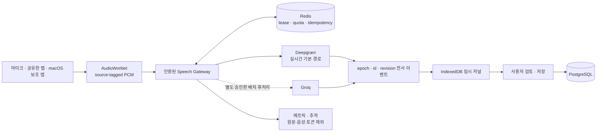

# 모이다 서비스화 계획

2026년 10월 7일 기준. 이 문서는 현재 코드로 확인한 사실과 출시 전 계획을 구분한다. 실제 회의 원문, API 키, 임시 토큰은 진단·로그·문서에 남기지 않는다.

## 제품 목표와 출시 기준

모이다의 우선순위는 `빠른 중간 전사 → 정확한 확정 전사 → 사람이 검토한 저장 → 근거가 보이는 AI 확인`이다. AI 요약 기능의 확장보다 전사 품질과 데이터 안전성을 먼저 확보한다.

서비스 공개 전에는 다음 조건을 모두 만족해야 한다.

- 음성 공급자마다 별도 동의와 명시적 선택을 유지하고 자동 fallback·이중 전송을 하지 않는다.
- 미확정 전사, 확정 전사, 사용자가 저장한 원문, AI 제안을 서로 다른 상태로 표시한다.
- 팀 권한 회수는 느린 외부 요청이 끝난 뒤에도 다시 확인한다.
- 삭제는 즉시 영구 삭제하지 않고 복구 가능한 휴지통을 거친다. 영구 삭제와 보존 기간은 별도 정책으로 확정한다.
- 실제 회의 거리·잡음·동시 발화·한영 혼합 조건으로 지연과 정확도를 측정한다.
- 비밀키, 토큰, 회의 원문을 애플리케이션 로그와 오류 추적 서비스에 남기지 않는다.

## 스피커 출력 전사 결정

### 1단계: 웹의 명시적 탭 오디오 공유

브라우저에서는 `getDisplayMedia()`로 사용자가 고른 브라우저 탭·창·화면의 오디오를 요청할 수 있다. 다만 오디오 제공 여부는 브라우저와 운영체제가 결정하므로 `audio: true`나 `systemAudio: include`가 성공을 보장하지 않는다. 권한은 매번 사용자 동작으로 다시 받아야 한다.

모이다의 웹 베타는 다음 원칙으로 구현한다.

- 기본 입력은 계속 마이크다. 사용자가 `공유한 탭 소리`를 별도로 선택해야만 화면 공유 선택기를 연다.
- 현재 모이다 탭은 선택 후보에서 제외하고, 전체 화면보다 브라우저 탭을 안내한다.
- 반환된 스트림에 실제 오디오 트랙이 없으면 전사를 시작하지 않고 탭의 `오디오 공유` 선택 방법을 안내한다.
- 브라우저가 함께 반환하는 화면 영상은 읽거나 서버에 보내지 않는다. 캡처 표시는 사용자가 직접 중단할 수 있어야 한다.
- 마이크와 탭 오디오를 합치는 기능은 울림·중복·개인정보 범위를 별도로 검증하기 전까지 자동 제공하지 않는다.

근거: [Chrome 화면 공유 제어](https://developer.chrome.com/docs/web-platform/screen-sharing-controls), [MDN getDisplayMedia](https://developer.mozilla.org/en-US/docs/Web/API/MediaDevices/getDisplayMedia), [W3C Screen Capture](https://www.w3.org/TR/screen-capture/).

### 2단계: macOS 네이티브 캡처 검토

macOS에서 회의 앱 전체의 시스템 오디오와 마이크를 안정적으로 함께 받으려면 브라우저만으로 보장할 수 없다. 장기 대안은 서명된 macOS 보조 앱에서 ScreenCaptureKit의 시스템 오디오·마이크 출력을 받고, 사용자가 선택한 범위만 로컬 웹 앱에 전달하는 방식이다. 화면 녹화·마이크 권한, 앱 서명, 업데이트, 로컬 IPC 보안이 추가되므로 웹 베타 검증 뒤 별도 프로젝트로 진행한다.

근거: [Apple ScreenCaptureKit](https://developer.apple.com/documentation/screencapturekit/capturing-screen-content-in-macos), [Apple WWDC24 캡처 업데이트](https://developer.apple.com/videos/play/wwdc2024/10088/).

## 출시 차단 항목

### 권장 운영 구조

실시간 전사와 배치 후처리는 서로 다른 제품 경로로 취급한다. Groq와 Deepgram의 자동 fallback이나 동시 전송은 하지 않고, 비교·후처리가 필요하면 사용자가 그 작업과 공급자를 별도로 승인한다.

### P0 — 공개 서비스 전에 필수

- Deepgram 브라우저 직접 토큰 연결을 서버 중계로 바꾸고 팀별 동시 연결·분당 음성·월 예산·강제 종료를 적용한다.
- 저장 전 전사 변경을 IndexedDB에 사용자·회의·기준 리비전별로 저널링하고, 재진입 시 복구·다운로드·삭제를 선택하게 한다. 자동 서버 업로드는 하지 않는다.
- 전사 중 이동은 `stopAndDrain()`으로 남은 응답을 기다린 뒤 저장·다운로드·명시적 폐기를 선택하게 한다.
- 로그인·회원가입·팀 초대·토큰 발급·음성 전사·AI 요청에 사용자/IP/팀 단위 제한을 적용한다. 다중 인스턴스에서는 공유 저장소 기반 제한이 필요하다.
- PostgreSQL 운영 환경, 암호화된 백업, 복구 훈련, 키 회전, 운영 비밀 저장소를 준비한다. H2 파일 DB는 로컬 개발용이다.
- 실제 회의 전사 평가표를 만들고 첫 중간 결과 지연, 확정 지연 p50/p95, 한국어 CER, 영어 용어·숫자·날짜·부정어 보존, 중복·누락을 공급자별로 측정한다.
- 개인정보 처리·참석자 고지·보존 기간·삭제 요청·데이터 내보내기 정책과 UI를 확정한다.
- 오류 추적과 운영 메트릭에서 원문·질문·AI 답변·키·토큰을 제거하는 필터를 검증한다.
- 루트 레거시 Nuxt 경로를 Spring/Vue 서비스 배포물에서 제거·격리하거나, 현재 감사에서 확인된 high 7건·critical 7건을 호환 가능한 수정 버전으로 해소하고 전체 회귀 검증한다. 강제 다운그레이드는 적용하지 않는다.
- 팀별 저장 용량, 회의별 전사 리비전 수, 요청 크기, 음성 초, 모델 토큰과 월 비용에 영속 쿼터를 적용한다.
- 휴지통 보존 기간과 `purge_after`를 정하고 전사·할 일·임시 작업을 멱등하게 영구 삭제하는 작업을 구현한다.

### P1 — 제한 베타 전에 필수

- 웹 탭 오디오 입력을 명시적 베타 옵션으로 연결하고 오디오 트랙 없음·공유 중단·권한 거절·탭 전환을 테스트한다.
- Deepgram 중간/확정 상태를 `StreamingTranscript` 하나로 통합하고 연결 세대, 중복, 늦은 응답, `is_final`과 `speech_final`의 차이를 테스트한다.
- 회의 휴지통 UI, 복구, 권한 오류, 저장 전 삭제 방지, 감사 로그 조회를 연결한다.
- 브라우저 E2E로 가입→팀→회의→마이크/가짜 입력→수정→저장→종료→삭제→복구를 검증한다.
- API 타임아웃, 오프라인, 401/403/404/409/429/5xx, 중복 제출과 느린 응답에 대한 복구 행동을 통일한다.
- 보안 헤더(CSP 포함), HTTPS 전용 쿠키, 프록시 신뢰 범위, 세션 만료 UX를 운영 환경에서 검증한다.
- 팀원 제거, 초대 코드 회전·만료·폐기, 소유권 이전과 회의 편집 역할을 구현한다.
- 외부 공급자 전송은 원문 없는 공개 이력으로 actor, provider, purpose, data category, 정책 버전, request id, 결과를 남긴다.
- 접근성 자동 검사와 키보드·200% 확대·모바일 화면 검증을 CI에 추가한다.

### P2 — 정식 출시 품질

- 수동 화자 이름 편집과 다운로드 반영, 발화 병합·분할, 잘못된 문장 삭제·실행 취소를 구현한다.
- 팀 공유 자료 검색 선택, 인용 원문 열기, 권한 변경 즉시 반영을 UI에서 완성한다.
- 장시간 회의의 메모리·큐·비용·백그라운드 전환·절전 복귀를 부하 테스트한다.
- 데이터 내보내기, 계정 탈퇴, 팀 탈퇴/소유권 이전, 영구 삭제 대기 기간과 관리자 절차를 구현한다.
- 운영 대시보드에는 공급자 상태, 지연, 오류율, 큐 길이, 사용량만 기록하고 원문은 기록하지 않는다.

## 현재 구현 상태

- Groq 배치 전사와 별도 선택형 Deepgram 실시간 테스트가 있으며 자동 fallback과 이중 전송은 없다.
- Deepgram은 임시 토큰을 사용하지만 공개 다중 사용자 서비스에 필요한 서버 중계와 조직 단위 쿼터는 아직 없다.
- Groq의 4초 직렬 배치 경로는 공급자 응답이 입력 속도보다 느릴 때 적체되고, 짧은 요청은 공급자 최소 과금 단위와 조직 RPM에 불리할 수 있어 실시간 기본 경로로 승격하지 않는다.
- V6에서 회의 휴지통 필드와 삭제/복구 API를 추가했다. 회의를 만든 사람 또는 팀 소유자만 수행하며 감사 로그를 남긴다. 프런트 연결과 영구 삭제 정책은 남아 있다.
- 전사 저장은 낙관적 버전 충돌을 검사하고, AI·자료 접근은 처리 전후 권한을 다시 확인한다.
- 로컬·Azure·Groq 응답 본문은 총 시간과 크기를 제한한다. 브라우저 취소를 공급자 호출까지 전파하는 비동기 실행 경계는 남아 있다.
- 현재 자동 테스트는 핵심 단위 흐름을 다루지만 실제 브라우저 종단·접근성·부하·복구 테스트가 부족하다.

## 다음 구현 순서

1. 저장 전 회의 기록을 보호한 뒤 프런트에 휴지통·복구 UI와 공유 탭 오디오 베타를 연결한다.
2. 가짜 `MediaStream`, 모의 STT API와 모의 WebSocket으로 정상·거절·오디오 없음·중단·지연·중복·재연결을 종단 테스트한다.
3. Deepgram 상태 처리기를 통합하고 서버 중계 설계를 확정한다.
4. 운영 보안·관측·백업·속도 제한을 적용한 제한 베타 환경을 만든다.
5. 참석자 동의를 받은 동일 음성 세트로 공급자 비교를 수행하고 출시 기준을 통과한 구성만 기본값으로 지정한다.
